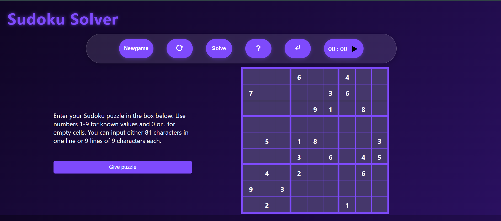
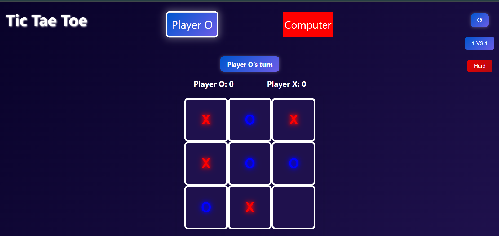

# 🎮 Mini Games

Welcome to **Mini Games**, a collection of interactive browser-based games built with HTML, CSS, and JavaScript. This project currently includes:

- ✅ **Tic Tac Toe** with Smart AI and Sound Effects  
- ✅ **Sudoku Solver** with Custom Input and Visual Solver

🔗 [Live Demo](https://keshavk1.github.io/Mini_games/)

---

## 📌 Games Included
### 1. 🧠 Sudoku Solver




Solve any valid Sudoku puzzle instantly. This game features:
- Clean and modern UI with dark theme styling
- Support for both 81-character string input or manual grid input
- Timer to challenge yourself
- Visual solver using backtracking algorithm
- New puzzle generator & reset options

### 2. ❌⭕ Tic Tac Toe




Enjoy a visually enhanced classic game with:
- 1v1 and Player vs Computer modes
- Smart AI using **Minimax Algorithm** for unbeatable gameplay
- Difficulty toggles (Easy / Hard)
- Real-time score tracking
- Sound effects on win, draw, and moves
- Fully responsive layout for desktop and mobile

### 3. ✊✋✌️ Rock Paper Scissors

    -The timeless hand game with a modern twist. 
    -Play against the computer with animated gestures. 
    -Score tracking, and special "extreme" mode with additional options.
---

## 🛠️ Tech Stack

- **HTML5**
- **CSS3**
- **JavaScript (Vanilla)**
- AI with **Minimax Algorithm**
- Audio effects for better interaction

---

## 🚀 How to Run Locally

1. Clone the repo:
   ```bash
   git clone https://github.com/keshavk1/Mini_games.git
   cd Mini_games
   ```

2. Open `index.html` in your browser.

---

## 📸 Screenshots

You can include these images (rename if needed):
- `sudoku-screenshot.png` → 
- `tictactoe-screenshot.png` → 
-

---

## ✨ Features

- ✅ Interactive UI with stylish dark theme
- ✅ Mobile Responsive
- ✅ Real-time sound effects
- ✅ Smart AI (Minimax) for Tic Tac Toe
- ✅ Puzzle generator and solver (Sudoku)

---


---

## 📜 License

This project is open-source and free to use. Customize or expand it for your portfolio or learning!

---

## 🙌 Author

Made with ❤️ by **Keshav Meena**  
🔗 [GitHub](https://github.com/keshavk1)
